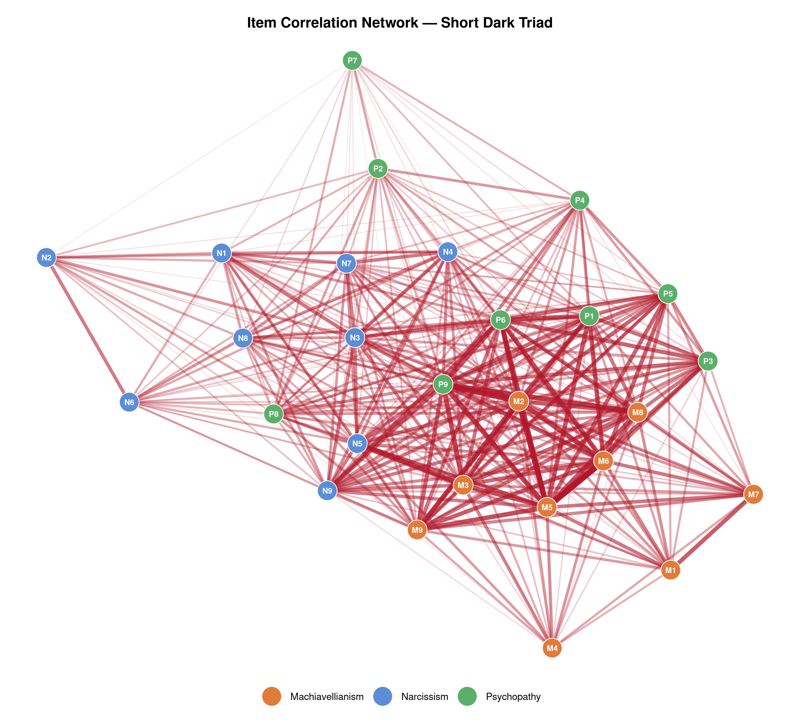
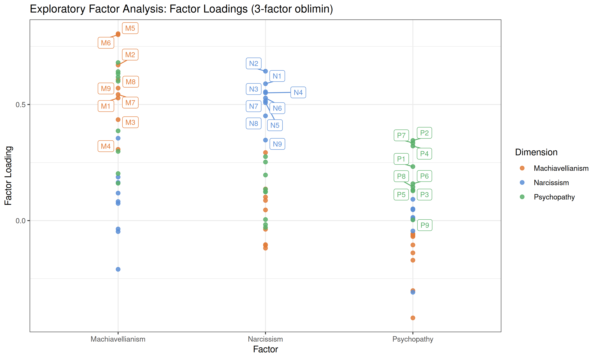
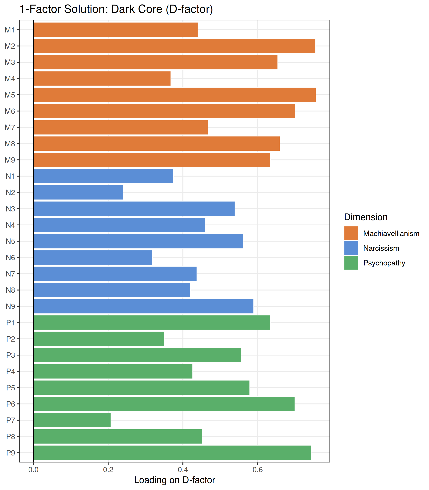
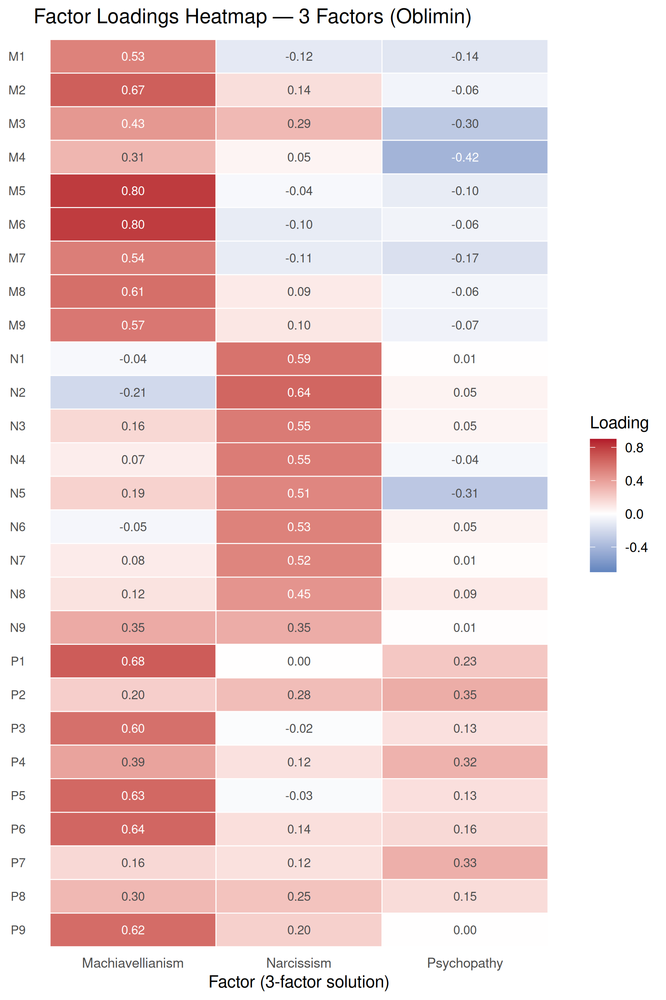
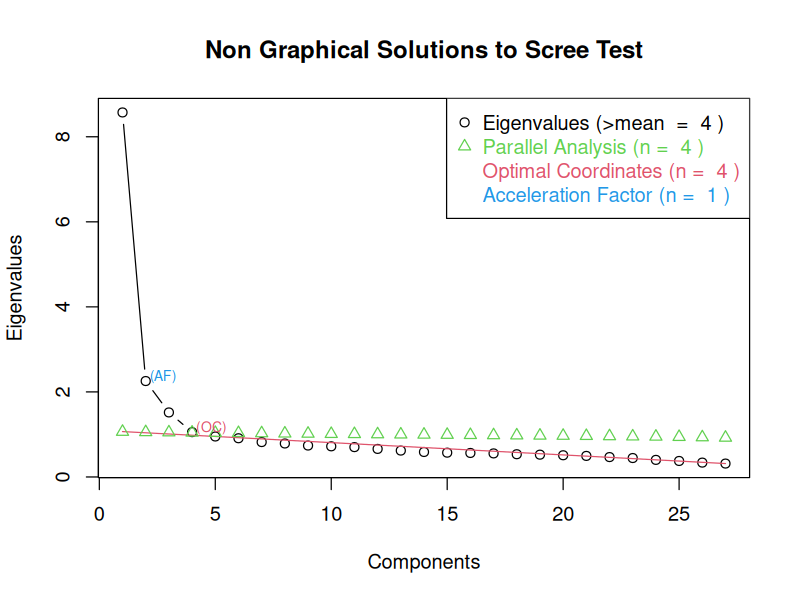
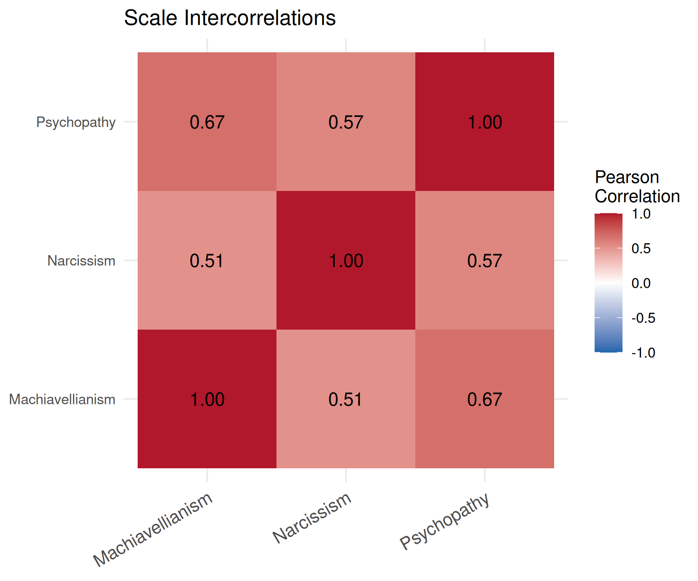
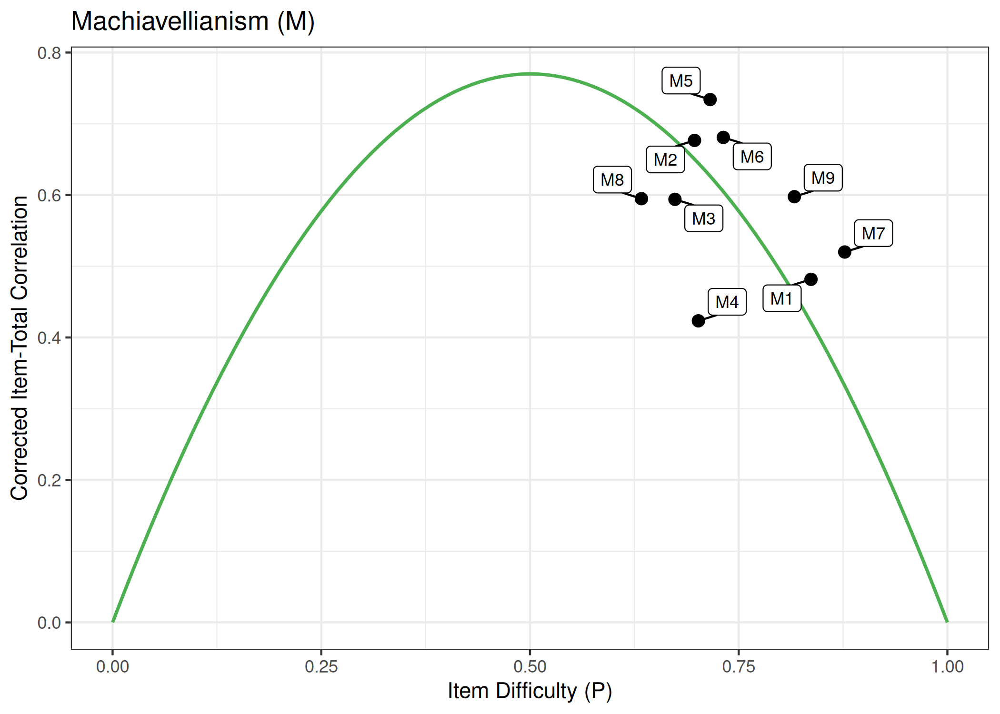
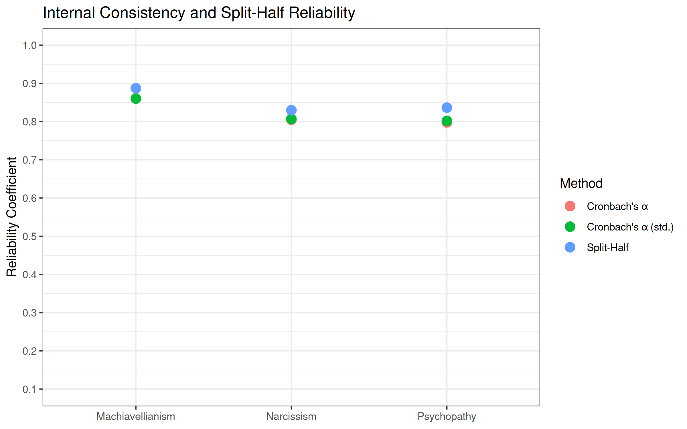

# Short Dark Triad (SD3): Item & Scale Analysis

Psychometric item analysis of the 27-item [Short Dark Triad (SD3)](https://openpsychometrics.org/tests/SD3/) questionnaire in R, including item statistics, factor analysis, and reliability estimation.

A central focus is the **D-factor debate**: does a single general "dark core" factor or three distinct trait factors better describe the data? The analysis compares 1-, 2-, and 3-factor EFA solutions using RMSEA, TLI, CFI, and BIC.

<p align="center">
  
  
</p>

<p align="center">
  
  
  
</p>

<p align="center">
  
  
  
</p>

## Data

This project uses the [SD3 dataset](http://openpsychometrics.org/_rawdata/SD3.zip) from [Open Psychometrics](https://openpsychometrics.org/) (~18,000 responses to the 27-item SD3 questionnaire).

## Setup

1. **Install R** (>= 4.0) from [r-project.org](https://www.r-project.org/)
2. **Download the data** from [openpsychometrics.org](http://openpsychometrics.org/_rawdata/SD3.zip) and unzip into `src_data/` so that `src_data/SD3/data.csv` exists
3. **Install packages** by running `setup.R`:
   ```r
   source("setup.R")
   ```

## Scripts

Run the scripts in numbered order. Each script sources its dependencies automatically.

| Script | Content |
|--------|---------|
| `01_data_preparation.R` | Load data, define item metadata, recode negatively keyed items, compute scale scores |
| `02_item_analysis.R` | Item descriptives, item histograms, corrected item-total correlations, difficulty-discrimination plots |
| `03_scale_analysis.R` | Dimension descriptives, scale intercorrelations, EFA (1/2/3-factor fit comparison, D-factor plot, loadings heatmap & scatter, item correlation network), reliability |

## Dark Triad Dimensions

| Code | Dimension | Items | Reversed |
|------|-----------|-------|---------|
| M | Machiavellianism | M1 -- M9 | — |
| N | Narcissism | N1 -- N9 | N2, N6, N8 |
| P | Psychopathy | P1 -- P9 | P2, P7 |

## EFA Results

| Factors | RMSEA | TLI | CFI | BIC |
|---------|-------|-----|-----|-----|
| 1 (D-factor) | .082 | .755 | .773 | 35,719 |
| 2 | .062 | .861 | .882 | 17,483 |
| 3 | .052 | .903 | .925 | **10,431** |

The 3-factor solution fits best, but the 1-factor D-factor solution is not negligible — consistent with the dark core literature.

## Required R Packages

tidyr, dplyr, tibble, moments, ggplot2, ggrepel, scales, psych, nFactors, igraph

## Reference

Jones, D. N., & Paulhus, D. L. (2014). Introducing the Short Dark Triad (SD3): A brief measure of dark personality traits. *Assessment, 21*(1), 28–41.
